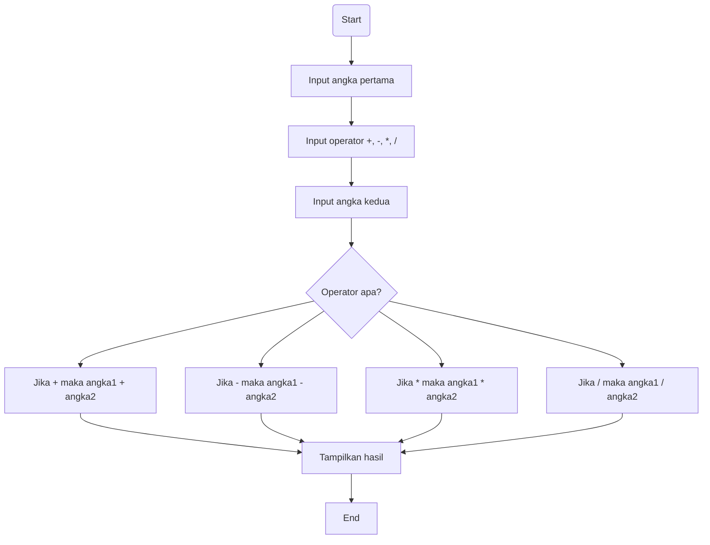

# Kalkulator Python dengan Tkinter

### Pendahuluan

Aplikasi kalkulator ini dibangun dengan menggunakan bahasa pemrograman Python dan library Tkinter untuk antarmuka pengguna (UI). Program ini menyediakan fungsionalitas dasar kalkulator seperti penjumlahan, pengurangan, perkalian, pembagian, serta beberapa fitur tambahan seperti pengaturan nilai positif/negatif, persen, dan akar kuadrat. Kalkulator ini dirancang untuk memberikan pengalaman pengguna yang sederhana dan mudah digunakan.

### Fitur Utama:

- Operasi Dasar: Penjumlahan, pengurangan, perkalian, dan pembagian.

- Tombol AC: Menghapus semua input dan mengatur ulang kalkulator.

- Tombol +/-: Mengubah tanda angka yang dimasukkan (positif/negatif).

- Tombol %: Menghitung persentase dari nilai yang dimasukkan.

- Tombol Akar Kuadrat: Menghitung akar kuadrat dari nilai yang dimasukkan.

- Desain UI: Antarmuka yang sederhana dan mudah dipahami dengan ukuran font yang besar dan tombol-tombol yang jelas.

- Tombol Desimal: Memungkinkan input angka desimal.

### Panduan Instalasi

1. Pastikan Python 3 sudah terpasang
   python --version

2. Clone repository
   git clone https://github.com/username/nama-repository.git
   
3. Masuk ke folder proyek
   cd nama-repository
   
5. Tidak perlu install library tambahan
   Program hanya menggunakan Tkinter yang sudah tersedia secara default di Python.

### Panduan Menjalankan Program
Jalankan file kalkulator dengan perintah: python main.py

atau: python calculator.py

(Jendela kalkulator akan muncul dengan otomatis di tengah layar.)

### Dokumentasi Teknik

### Daftar Kontributor
| No | Nama                | NIM           | Link Akun Github                        |
|----|---------------------|---------------|-------------------------------------------|
| 1 | Gerry Brillian Bawoel | 250211060097  | https://github.com/Deeznake |
| 2 | Kenzo Prayer Sidney Kandow | 250211060122  | https://github.com/KenzoKandow |
| 3 | Mark Dimian Rasyah Mahmud | 250211060099  | https://github.com/RasyaMahmud |
| 4 | Meyke Nadin Moningka | 250211060137  | https://github.com/NadinMoningka |
