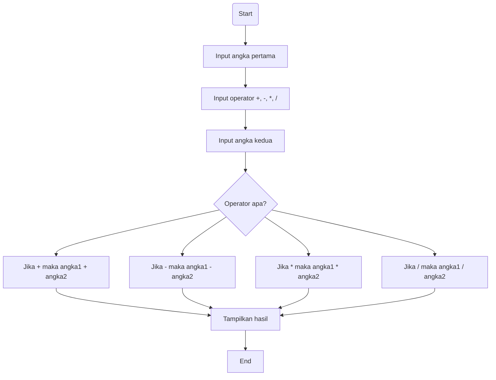

# Kalkulator Python dengan Tkinter


## Pendahuluan

Proyek ini merupakan aplikasi **kalkulator** yang dibangun menggunakan bahasa pemrograman **Python** dengan library **Tkinter** sebagai antarmuka pengguna (GUI).  
Aplikasi dirancang untuk menjalankan operasi aritmetika dasar serta beberapa fungsi tambahan yang umum digunakan dalam kalkulator sehari-hari.

## Fitur Utama

- **Operasi Dasar**  
  Mendukung penjumlahan, pengurangan, perkalian, dan pembagian.

- **Tombol AC (All Clear)**  
  Menghapus seluruh input dan mengatur ulang tampilan kalkulator ke kondisi awal.

- **Tombol +/-**  
  Mengubah tanda bilangan yang sedang ditampilkan (positif ↔ negatif).

- **Tombol % (Persen)**  
  Menghitung persentase dari nilai yang dimasukkan.

- **Tombol Akar Kuadrat (√)**  
  Menghitung akar kuadrat dari nilai yang sedang ditampilkan.

- **Tombol Desimal (.)**  
  Memungkinkan input bilangan desimal.

- **Desain Antarmuka**  
  Tampilan sederhana dan bersih, dengan:
  - Font angka yang besar dan mudah dibaca  
  - Tombol-tombol yang jelas dan mudah diakses  
  - Layout yang intuitif bagi pengguna baru

## Panduan Instalasi

1. **Pastikan Python 3 sudah terpasang**

   Cek versi Python dengan perintah:
   ```bash
   python --version

2. Clone repository  
   ```bash
   git clone https://github.com/Deeznake/kelompok6-kalkulator-python.git
   ```

3. Masuk ke folder proyek  
   ```bash
   cd kelompok6-kalkulator-python
   ```

4. Tidak perlu install library tambahan  
   Program hanya menggunakan Tkinter yang sudah tersedia secara default di Python.

## Panduan Menjalankan Program

Jalankan file kalkulator dengan perintah berikut:
```bash
python main.py
```
atau:
```bash
python calculator.py
```
Jendela kalkulator akan muncul secara otomatis di tengah layar.

## Dokumentasi Teknik


## Daftar Kontributor

| No | Nama                          | NIM            | Link Akun Github                      |
|----|-------------------------------|----------------|----------------------------------------|
| 1  | Gerry Brillian Bawoel         | 250211060097   | [Deeznake](https://github.com/Deeznake) |
| 2  | Kenzo Prayer Sidney Kandow     | 250211060122   | [KenzoKandow](https://github.com/KenzoKandow) |
| 3  | Mark Dimian Rasyah Mahmud     | 250211060099   | [RasyaMahmud](https://github.com/RasyaMahmud) |
| 4  | Meyke Nadin Moningka          | 250211060137   | [NadinMoningka](https://github.com/NadinMoningka) |
