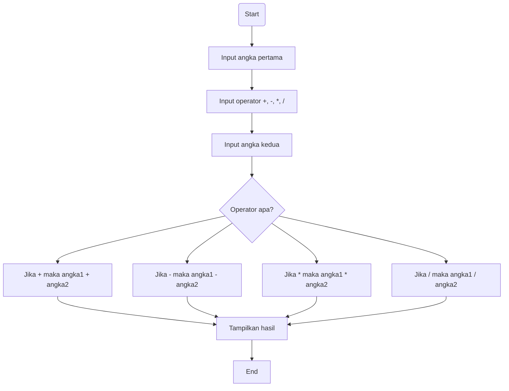

# Kalkulator Python dengan Tkinter


## Pendahuluan

Aplikasi kalkulator ini dibangun menggunakan bahasa pemrograman **Python** dan library **Tkinter** untuk antarmuka pengguna (UI). Program ini menyediakan fungsionalitas dasar kalkulator seperti penjumlahan, pengurangan, perkalian, dan pembagian, serta beberapa fitur tambahan.

## Fitur Utama

- **Operasi Dasar**: Penjumlahan, pengurangan, perkalian, dan pembagian.
- **Tombol AC**: Menghapus semua input dan mengatur ulang kalkulator.
- **Tombol +/-**: Mengubah tanda angka yang dimasukkan (positif/negatif).
- **Tombol %**: Menghitung persentase dari nilai yang dimasukkan.
- **Tombol Akar Kuadrat**: Menghitung akar kuadrat dari nilai yang dimasukkan.
- **Desain UI**: Antarmuka yang sederhana, mudah dipahami, dengan ukuran font besar dan tombol-tombol jelas.
- **Tombol Desimal**: Memungkinkan input angka desimal.

## Panduan Instalasi

1. Pastikan **Python 3** sudah terpasang  
   ```bash
   python --version
   ```

2. Clone repository  
   ```bash
   git clone https://github.com/Deeznake/kelompok6-kalkulator-python.git
   ```

3. Masuk ke folder proyek  
   ```bash
   cd kelompok6-kalkulator-python
   ```

4. Tidak perlu install library tambahan  
   Program hanya menggunakan Tkinter yang sudah tersedia secara default di Python.

## Panduan Menjalankan Program

Jalankan file kalkulator dengan perintah berikut:
```bash
python main.py
```
atau:
```bash
python calculator.py
```
Jendela kalkulator akan muncul secara otomatis di tengah layar.

## Dokumentasi Teknik


